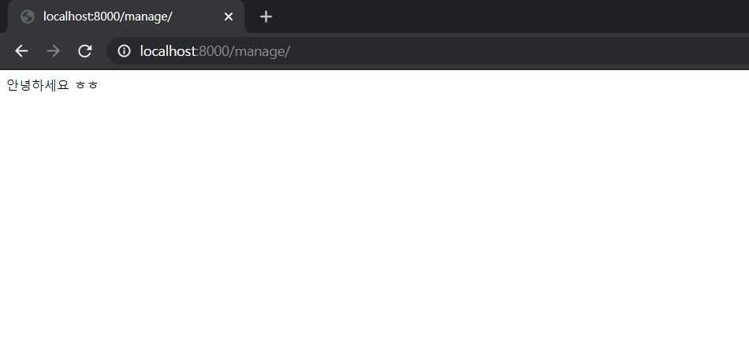
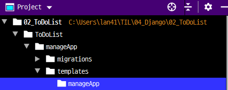
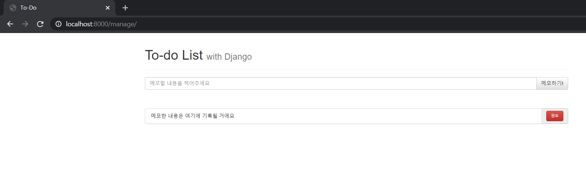

###### 2020-10-13 화요일

###### by Lee-JaeWon


# ToDoList

> ToDoList를 만들어 봅시다


## 1. Django 세팅하기

> Django를 인스톨한 상태이서 진행해야 합니다.
>
> 1. teminal 창에서 `django-admin startproject ToDoList`를 입력한다.
>
>    다음 `cd ToDoList`를 입력하여 경로를 바꾸어준다.
>
>    여기서 `ToDoList`는 지금 진행하고자 하는 장고프로젝트 명이다.
>
>    
>
> 2. teminal 창으로 돌아와서 `python manage.py startapp manageApp`을 입력한다.
>
>    여기서 `manageApp`은 Django의 MVT 패턴에서 V를 가지고 있는 Application이다.
>
>    
>
> 3. `ToDoList` > `ToDoList`에 있는 `settings.py`에서 다음과 같이 코드를 추가한다.
>
>    ```python
>    INSTALLED_APPS = [
>        'django.contrib.admin',
>        'django.contrib.auth',
>        'django.contrib.contenttypes',
>        'django.contrib.sessions',
>        'django.contrib.messages',
>        'django.contrib.staticfiles',
>        'manageApp',  ## 이것을 입력해주자
>    ]				  ## V(Views)를 가지고 있는 App의 이름을 입력해 주는 것이다.
>    ```


## 2. URL 설정하기

> 사용자가 홈페이지에서 요청을 보낼때, `manageApp`이 가지고 있는 `Views`를 URL로 연결해 주어야 한다.
>
> 1. 우선 `ToDoList` > `ToDoList`에 있는 `urls.py`에서 다음과 같이 입력해주자
>
>    ```python
>    from django.contrib import admin
>    from django.urls import path, include ## 내가 추가해준것
>    
>    urlpatterns = [
>        path('admin/', admin.site.urls),
>        path('manage/', include('manageApp.urls'))  ## 내가 추가해준것
>    ]
>    ```
>
>    설명을 덧 붙이자면, ` path('manage/', ...)`이기 때문에
>
>     사용자가 앞서 만든 `mangeApp`을 사용하기 위해서는 다음과 같은 url로 접근해야한다. 
>
>    ```http
>    http://localhost:8000/manage/
>    ```
>
>    이 과정은 사용자의 request를 `manageApp`으로 보내주는 과정이라고 생각하면 된다.
>
> 
>
> 2. 다음으로 `ToDoList` > `manageApp` 폴더에 `urls.py`파일을 만들고 다음과 같이 입력한다.
>
>    ```python
>    from django.urls import path
>    from manageApp import views   ## manageApp 폴더에 있는 views.py모듈을 							      ## 임포트 하겟다 
>    urlpatterns = [
>        path('', views.index)     ## manage.py 폴더에 view.py에 있는 함수인
>    ]							  ## index함수를 사용한다
>    ```
>
>    
>
> 3.  이제 manageApp 폴더에 있는 `view.py`에 사용할 함수를 정의해 줄것이다.
>
>    ```python
>    from django.shortcuts import render, HttpResponse  ## 내가 추가해준것
>    
>    # Create your views here.
>    
>    def index(request) :  ## 내가추가해준함수
>        return HttpResponse('안녕하세요 ㅎㅎ')
>    ```
>
>    
>
> 4.  `python manage.py runserver`를 입력한다.
>
>    이까지 잘 따라왔다면, 크롬에서 `http://localhost:8000/manage/`입력시
>
>    다음과 같은 화면이 나타날 것이다.
>
>    
>


## 3. Template 사용하기

> 그렇다 MVT패턴에서 T에 해당하는 Template, HTML이다. HTML 파일은책에서 제공해주는 파일을 사용하였다.
>
> 1. `ToDoList` > `manageApp` 폴더에 `templates`폴더를 만든다.
>
>    그 후, `templates` 폴더안에 `manageApp`이라는 폴더를 만든다.
>
>    결론적으로 아래와 같은 그림이 나와야 한다.
>
>    
>
>    
>
> 2. 이제 만들어진 `templates`  > `manageApp` 폴더에 html파일을 넣고 관리할 것이다. 
>
>    우리는 지금 책에서 제공해주는 html 파일인 `index.html` 파일을 넣고 사용해 볼것이다.
>
>    `index.html`의 코드는 다음과 같다.
>
>    ```html
>    <html lang="ko">
>    <head>
>        <meta charset="UTF-8">
>    
>        <!-- Boot strap -->
>        <!-- 합쳐지고 최소화된 최신 CSS -->
>        <link rel="stylesheet" href="https://maxcdn.bootstrapcdn.com/bootstrap/3.3.2/css/bootstrap.min.css">
>        <!-- 부가적인 테마 -->
>        <link rel="stylesheet" href="https://maxcdn.bootstrapcdn.com/bootstrap/3.3.2/css/bootstrap-theme.min.css">
>        <!-- 합쳐지고 최소화된 최신 자바스크립트 -->
>        <script src="https://maxcdn.bootstrapcdn.com/bootstrap/3.3.2/js/bootstrap.min.js"></script>
>    
>        <style>
>            .content{
>                height: 75%;
>            }
>            .messageDiv{
>                margin-top: 20px;
>                margin-bottom: 50px;
>            }
>            .toDoDiv{
>    
>            }
>            .custom-btn{
>                font-size: 10px;
>            }
>            .panel-footer{
>                height:10%;
>                color:gray;
>            }
>        </style>
>    
>        <title>To-Do</title>
>    </head>
>    <body>
>        <div class="container">
>            <div class="header">
>                <div class="page-header">
>                    <h1>To-do List <small>with Django</small></h1>
>                </div>
>            </div>
>            <div class="content">
>                <div class="messageDiv">
>                    <form action="" method="POST">
>                        <div class="input-group">
>                            <input id="todoContent" name="todoContent" type="text" class="form-control" placeholder="메모할 내용을 적어주세요">
>                            <span class="input-group-btn">
>                                <button class="btn btn-default" type="submit">메모하기!</button>
>                            </span>
>                        </div>
>                    </form>
>                </div>
>    
>                <div class="toDoDiv">
>                    <ul class="list-group">
>    
>                        <form action="" method="GET">
>                            <div class="input-group" name='todo1'>
>                                <li class="list-group-item">메모한 내용은 여기에 기록될 거에요</li>
>                                <input type="hidden" id="todoNum" name="todoNum" value="1"></input>
>                                <span class="input-group-addon">
>                                    <button type="submit" class="custom-btn btn btn-danger">완료</button>
>                                </span>
>                            </div>
>                        </form>
>    
>                    </ul>
>                </div>
>            </div>
>            <div class="panel-footer">
>                실전예제로 배우는 Django. Project1-TodoList
>            </div>
>        </div>
>    </body>
>    </html>
>    ```
>
>    
>
> 3. 그런 다음 `ToDoList` > `manageApp` > `views.py`에서 만들었던 `index`함수를 다음과 같이 바꿔주자
>
>    ```python
>    from django.shortcuts import render, HttpResponse
>    
>    # Create your views here.
>    
>    def index(request) :
>        return render(request, 'manageApp/index.html')  ## 바꿔준건 이부분
>    
>    ```
>
>    `render`라는 함수는 request를 보내주는 것이라고 이해하면 될 것이다.
>
> 4. 이제 다음과 같은 url 주소를 입력하면 다음 그림과 같은 화면을 볼 수 있다.
>
>    ```http
>    http://localhost:8000/manage/
>    ```
>
>    


지금까지 잘 따라왔다면, 

아직 사용은 하지 못하지만 그럴 듯한 홈페이지의 모습이 나타날 것이다.