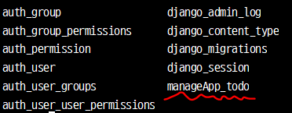

###### 2020-10-15 목요일

###### by Lee-JaeWon


# ToDoList (2)


## 1. M(model) 사용하기

> MVT 패턴에서 Model에 해당하는 M이다. model은 (sql같은) 데이터베이스에서 Table에 해당한다고 생각하면 된다.
>
> 1. `ToDoList` > `manageApp` > `model.py` 에서 다음과 같이 코드를 작성해본다.
>
>    ```python
>    from django.db import models
>    
>    # Create your models here.
>    
>    class Todo(models.Model):
>    	content = models.CharField(max_length = 255)
>    ```
>
>    위의 ToDo 라는 클레스 이름은 하나의 Model, (sql로 따지자면 하나의 테이블)이라고 생각하면 될 것이다.
>
>    위 ToDo 클래서는 `content`라는 문자열 칼럼을 가지는 모델(=테이블)이다.
>
> 2. model 클래스 (sql로 따지면 하나의 테이블)을 만들면, `migration`이라는 작업을 해주어야 한다. terminal창에서 다음과 같이 입력하자.
>
>    아 그리고 밑의 작업은 `python manage.py runserver`가 실행되고 있지 않은 상태에서 진행하여야 한다.
>
>    만약 서버가 실행 중이라면 `ctrl + c`를 눌러 서버를 종료시킨후 아래 코드를 작성하라.
>
>    ```python
>    python manage.py makemigration    # 새롭게 만든 model을 생성하는 작업
>    python manage.py migrate          # 새롭게 만든 model을 장고프로젝트 데이터베이스에 실제로 적용하는 작업
>    ```
>
> 3.  위의`migrate`작업을 완료했다면 teminal 창에서 다음 보이는 코드를 입력하여 내가만든 ToDo 모델이 장고프로젝트 데이터베이스에 적용되었는지 확인해보자
>
>    ```python
>    python manage.py dbshell
>    .table
>    ```
>
>    위 코드를 입력했다면 다음과 같은 결과를 얻을 수 있다.
>
>    
>
>    `manageApp_todo`는 방금 migrate한 모델이름이고, 나머지는 Django에서 제공해주는 기본 모델(=테이블)이라고 생각하면 된다.