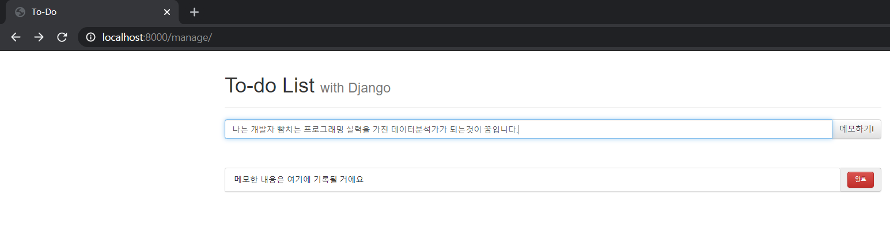
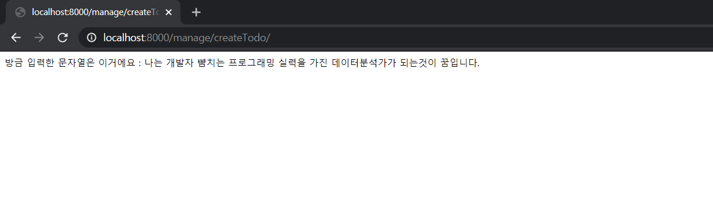
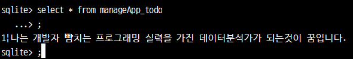

###### 2020-10-15 목요일

###### 2020-10-16 금요일

###### by Lee-JaeWon


# ToDoList (2)


## 1. M(model) 사용하기

> MVT 패턴에서 Model에 해당하는 M이다. model은 (sql같은) 데이터베이스에서 Table에 해당한다고 생각하면 된다.
>
> 1. `ToDoList` > `manageApp` > `model.py` 에서 다음과 같이 코드를 작성해본다.
>
>    ```python
>    from django.db import models
>    
>    # Create your models here.
>    
>    class Todo(models.Model):
>    	content = models.CharField(max_length = 255)
>    ```
>
>    위의 ToDo 라는 클레스 이름은 하나의 Model, (sql로 따지자면 하나의 테이블)이라고 생각하면 될 것이다.
>
>    위 ToDo 클래서는 `content`라는 문자열 칼럼을 가지는 모델(=테이블)이다.
>
> 2. model 클래스 (sql로 따지면 하나의 테이블)을 만들면, `migration`이라는 작업을 해주어야 한다. terminal창에서 다음과 같이 입력하자.
>
>    아 그리고 밑의 작업은 `python manage.py runserver`가 실행되고 있지 않은 상태에서 진행하여야 한다.
>
>    만약 서버가 실행 중이라면 `ctrl + c`를 눌러 서버를 종료시킨후 아래 코드를 작성하라.
>
>    ```python
>    python manage.py makemigration    # 새롭게 만든 model을 생성하는 작업
>    python manage.py migrate          # 새롭게 만든 model을 장고프로젝트 데이터베이스에 실제로 적용하는 작업
>    ```
>
> 3.  위의`migrate`작업을 완료했다면 teminal 창에서 다음 보이는 코드를 입력하여 내가만든 ToDo 모델이 장고프로젝트 데이터베이스에 적용되었는지 확인해보자
>
>    ```python
>    python manage.py dbshell
>    .table
>    ```
>
>    위 코드를 입력했다면 다음과 같은 결과를 얻을 수 있다.
>
>    
>
>    `manageApp_todo`는 방금 migrate한 모델이름이고, 나머지는 Django에서 제공해주는 기본 모델(=테이블)이라고 생각하면 된다.


## 2. 만들어진 `Todo` Model(M)에 데이터 입력하기

> 지금까지 우리는 아무런 기능도 수행할 수 없는 그럴듯한 홈페이지를 만들었다.
>
> 이제 홈페이지에서 데이터를 입력하여 Todo 모델에 저장하는 작업을 진행해보자.
>
> 1. `ToDoList` > `manageApp` > `templates` > `manageApp` > `index.html`로 들어가서 44번째 줄에 있는 `<form>`테그를 찾아보자.
>    - 기본적으로 html에서는 서버로 데이터를 전달할 때, `<form>`테그로 감싸야 한다. 그리고 이 `<form>`테그 안에는 데이터를 서버로 제출하는 `button`이 존재하며, 직접 전송되어지는 데이터가 담기는 `input`(46번째 줄)이 존재한다.
>    - 우리가 직접 건드릴 곳은 `<form>`테그의 `action`과 `method`이다. 
>    - (1) `method`
>      - 먼저 `method`에는 크게 `get`방식과 `post`방식이 존재하는데, 먼저 알아야 할 것은 `post`방식 일때, ``을 적어주여야 한다.
>      - 로그인을 예로들어 `get`과 `post`를 설명해 보자.
>      - 로그인 방법을 `get`방식으로 지정하면, url에 아이디와 비밀번호가 노출이 된다. 즉, `get`방식은 입력값이 url에 노출이 되는 방식인 것이다.
>      - 반대로 `post`방식은 노출이 되지않는다. 그래서 로그인은 `post`를 사용하는 것이다.
>    - (2) `action`
>      - `action`은 서버로 데이터를 전달할 때, 어떠한 경로로 url로 전달할 것인지를 나타낸다.
>      - 즉, `action`에 적어주는 경로로 데이터가 전달되는 것이다.
>
> 2. 44번째줄 `<fomr>`테그에 존재하는`action`을 다음과 같이 변경해주자
>
>    ```html
>    <form action="./createTodo/" method="POST">
>    ```
>
> 3. 그다음 `python manage.py runserver`를 입력하여 서버를 실행시킨 후, 메모하기 버튼을 눌러보면 다음과 같은 화면이 나타날 것이다.
>
>    
>
>    `Page not found (404)`에러는 페이지가 없어서 나타나는 에러이다. 아직 우리는 페이지를 만들지 않았기 때문에 에러가 나타나는건 당연한 일이니 놀라지마시라
>
>    `Page not found (404)`에러는 Django를 다루면서 앞으로 자주보게될 에러이다.


## 3. Model에 데이터 입력하고 홈페이지에 출력해보기

> 이제는 데이터를 입력하고 그것을 간단히 출력해보는 과정을 실습해보자.
>
> 아직까지 위에서 만든 Todo모델을 사용하는 것은 아니다!
>
> 
>
> 1. `ToDoList` > `manageApp`> `urls.py`에서 다음과 같이 코드를 작성하자
>
>    ```python
>    	
>    from django.urls import path
>    from manageApp import views
>    
>    urlpatterns = [
>        path('', views.index),
>        path('createTodo/', views.createTodo)  ## 새롭게 추가해준 코드
>    ]
>    ```
>
> 2. `ToDoList` > `manageApp` > `views.py`에서 다음과 같은 함수를 작성해 준다
>
>    ```python
>    def createTodo(request):
>        user_input_str = request.POST['todoContent']
>        return HttpResponse('방금 입력한 문자열은 이거에요 : '+ user_input_str)
>    ```
>
>    위에서 `request.POST['todoContent']`는 `index.html`의 코드를 보면서 설명할 필요가 있다.
>
>    ```html
>    <form action="./createTodo/" method="POST">
>    	<div class="input-group">
>    		<input id="todoContent" name="todoContent" type="text" class="form-control" placeholder="메모할 내용을 적어주세요">
>    		<span class="input-group-btn">
>    			<button class="btn btn-default" type="submit">메모하기!</button>
>    		</span>
>    	</div>
>    </form>
>    ```
>
>    위에서 `<form>`태그 안에 있는 `<input>`태그에 `name`이라는 속성을 보자. 이 속성 값은 사용자가 입력한 데이터를 지칭한다고 생각하면 된다. 
>
>    그레서 `name`의 속성값인 `todoContent`를 사용하여 사용자의 입력값을  
>
>    `user_input_str = request.POST['todoContent']`형태로 받아온 것이다.
>
> 3. `python manage.py runserver`를 입력하고 입력값을 입력하면 다음과 같은 화면을 볼 수 있다.
>
>    
>
>    


## 4. 입력한 데이터를 모델(데이터베이스)에 적용하기

> 위과정은 모델을 만들고, 데이터를 입력하여 출력하는 과정을 실습했다.
>
> 이제는 입력한 데이터를 모델(데이터베이스)에 적용해보자.
>
> 1. 모델을 사용하기 위해서는 `views.py`의 상단에 다음과 같은 코드를 작성해야 한다.
>
>    ```python
>    from django.shortcuts import render, HttpResponse
>    from .models import *  ## 새롭게 추가한 코드!
>    
>    # Create your views here.
>    
>    def index(request) :
>        return render(request, 'manageApp/index.html')
>    
>    def createTodo(request):
>        user_input_str = request.POST['todoContent']
>        return HttpResponse('방금 입력한 문자열은 이거에요 : '+ user_input_str)
>    ```
>
>    `from .models import`에서 model앞에 점(.)이 있음을 주의하라.
>
> 2.  그리고 다음과 같이 `createTodo`함수를 변경하라
>
>    ```python
>    def createTodo(request):
>        user_input_str = request.POST['todoContent']
>        new_todo = ToDo(content = user_input_str)  # 입력한 데이터를 Todo모델에 적용하는 코드
>        new_todo.save()   # 새롭게 입력한 데이터를 저장하는 코드
>        return HttpResponse('방금 입력한 문자열은 이거에요 : '+ user_input_str)
>    ```
>
> 3. 그 다음 `python manage.py runserver`를 입력하고, 홈페이지가 뜨면 데이터를 입력하고 메모하기 버튼을 누르자.
>
>    
>
>    
>
> 4. 그리고 terminal에서 다음과 같이 작성해서 새롭게 입력한 데이터가 정상적으로 입력이 되었는지 확인해보자
>
>    ```
>    - python manage.py dbshell
>    - (만약 Todo 모델의 데이터베이스병이 기억이 나지 않는다면? : 위 코드를 작성한 후 .table 입력하면 이름 확인가능)
>    - select * from manageApp_todo;
>    ```
>
>    위 코드를 작성하면 아래와 같이 Todo 모델에 데이터가 입력된 결과를 볼 수 있다.
>
>    