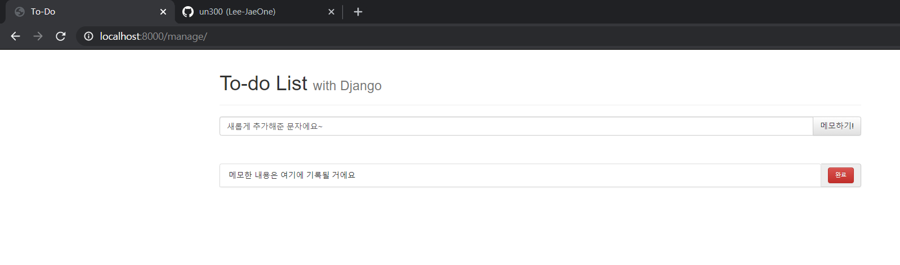
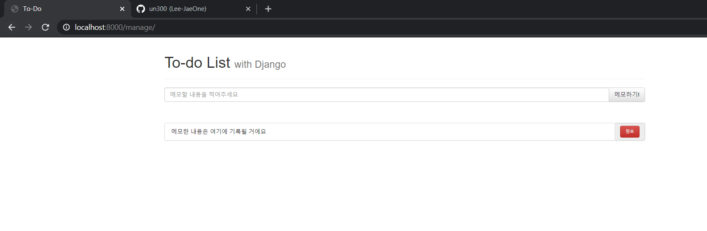
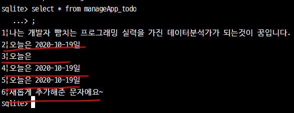
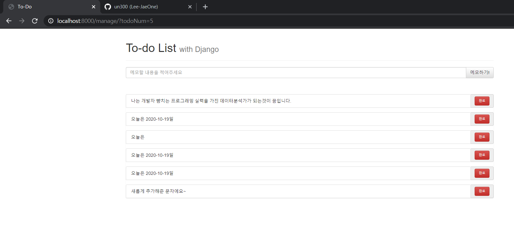
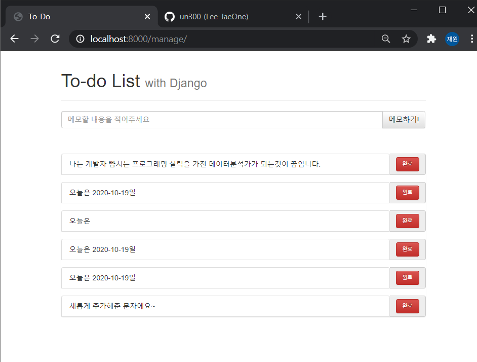
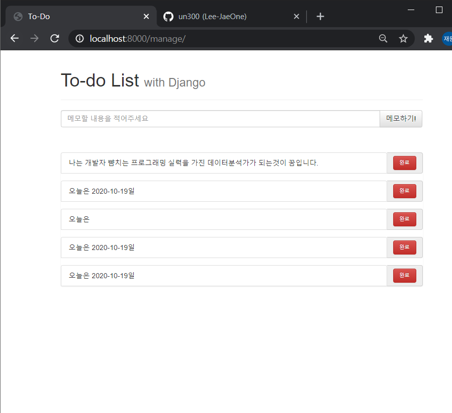
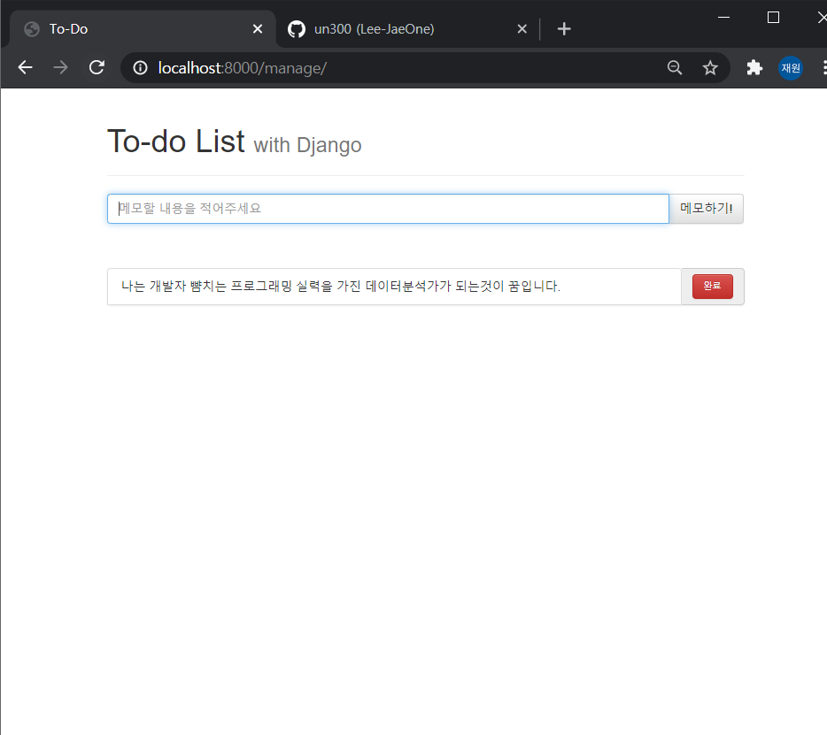

##### 2020-10-19 월요일

##### by Lee-jaeWon


# ToDoList (3)


## 1. Todo 모델에 데이터 입력

> 지금까지 '메모하기' 버튼을 누르면, 
>
> ​	1) 입력한 값이 나타나게 하는 것
>
> ​	2) 입력한 값이 `Todo` 모델에 입력되도록 하는것
>
> 두가지를 실습해 보았다. 이제는 '메모하기' 버튼을 누르면 화면 변화 없이 `Todo`모델에 데이터가 입력되도록(우리가 원하는데로 작동하도록) 만들어보자
>
> 
>
> 1.  '메모하기' 버튼을 누르면 원하는 입력값이 `Todo`라는 데이터베이스에 저장되는 것이 우리의 목표이다. 그렇다면 '메모하기' 버튼을 누르면 화면이 다른 페이지로 이동하는 것이 아니라. 원래의 페이지에 머물러야 한다. 
>
>    원래 홈페이지에 머무르는 작업을 해주자
>
>    
>
>    `ToDoList` > `manageApp` > `urls.py` 에서 다음과 같은 코드를 작성하자.
>
>    ```python
>    from django.urls import path
>    from manageApp import views
>    
>    urlpatterns = [
>        path('', views.index, name='index'),  # name추가
>        path('createTodo/', views.createTodo, name='createTodo') # name추가
>    ]
>    ```
>
>    `name`이라 함은, 새로운 홈페이지에 url을 넘겨줄때는 `render`함수를 사용하지만, 다시 이전의 홈페이지(?)로 돌아가고자 할때는 `HttpResponseRedirect()`라는 함수와 `reverse()` 함수를 사용한다. 
>
>    
>
>    `HttpResponseRedirect()` 사용법은 함수 안에 돌아가고 싶은 url path의 `name`을 `reverse()`함수와 함께 입력하여 사용하면 된다. 이해가 되지 않는다면 아래를 보자
>
>    
>
> 2. `ToDoList` > `manageApp` > `views.py`에서 다음과 같이 코드를 작성해 주자
>
>    ```python
>    from django.shortcuts import render, HttpResponse, HttpResponseRedirect #추가해줌
>    from django.urls import reverse  #추가해줌
>    from .models import *
>    
>    def index(request) :
>    	return render(request, 'manageApp/index.html')
>    
>    def createTodo(request):
>    	user_input_str = request.POST['todoContent']
>        new_todo = ToDo(content = user_input_str)
>        new_todo.save()
>        return HttpResponseRedirect(reverse('index')) ## 변경함
>    
>    ```
>
>    
>
>    `HttpResponseRedirect()`함수와 `reverse()`함수를 사용하기 위해  import 구문에 추가시켜 주었다. 
>
>    
>
>    `createTodo`함수의 return부분을 `HttpResponseRedirect`함수와 `reverse`함수로 변경해 주었다.
>
>    
>
>    `render`함수는 새로운 url로 request를 보내주는 것이라면, 
>
>    `HttpResponseRedirect`함수는 기존의 페이지로 다시 되돌아가는 함수라고 생각하면 된다.
>
>    
>
> 3.  이제 홈페이지에서 입력할 문자를 입력 후, '메모하기'를 누르면 페이지에 변화가 없다!
>
>     
>
>     
>
>     
>
>     
>
>     `python manage.py dbshell`로 확인해보면 새롭게 추가된 문자(데이터)를 볼 수 있다.
>
>     
>
>     ("새롭게 추가해준 문자에요~" 말고도 다른 데이터도 넣었는데.. 이미지로 저장 못했슴다 ㅎ.. 이해해주세요)
>
> 


## 2. '메모하기'에 입력한 데이터 홈페이지에 띄우기

> 지금까지, 홈페이지에 메모를 입력한 후, 페이지의 변화 없이 입력한 메모를 Todo 모델(데이터베이스)에 저장하는 과정을 실습하였다. 
>
> 
>
> 이제 Todo모델에 저장된 데이터를 홈페이지에 띄우는 실습을 진행하자
>
> 
>
> 1. 우선 `ToDoList` > `manageApp` > `views.py`에서 `index`함수를 다음과 같이 코드를 작성하자.
>
>    ```python
>    from django.shortcuts import render, HttpResponse, HttpResponseRedirect
>    from django.urls import reverse
>    from .models import *
>    
>    # Create your views here.
>    
>    def index(request) :  ## 변경해준 함수
>        todos = ToDo.objects.all() # 추가해줌
>        content = {'todos' : todos} # 추가해줌
>        return render(request, 'manageApp/index.html', content) # 추가해줌
>    
>    def createTodo(request):
>        user_input_str = request.POST['todoContent']
>        new_todo = ToDo(content = user_input_str)
>        new_todo.save()
>        return HttpResponseRedirect(reverse('index'))
>    ```
>
>    코드를 간단히 설명하자면, Todo 모델에서 데이터를 불러온다. 코드는 다음과 같다.
>
>    ```python
>    todos = ToDo.objects.all()
>    ```
>
>    
>
>    `contents`라는 딕셔너리를 만들어서 'todos'라는 key에 Todo 모델에서 가져온 데이터(todos)를 할당시킨다
>
>    ```python
>    content = {'todos' : todos}
>    ```
>
>    
>
>    render 함수 마지막에 만들어진 딕셔너리 `content`를 `index.html`로 전달한다.
>
>    ```python
>    return render(request, 'manageApp/index.html', content)
>    ```
>
>    
>
> 2. 위의 과정은 우리가 입력했던 Todo 모델 내의 데이터를 `manage.py`의 `views.py`의 `index`함수를 통해, `index.html`템플릿으로 보내주는 작업을 진행했다.
>
>    이제 데이터를 받은 `index.html`에서 입력했던 문자(데이터)를 출력하는 작업을 진행해 주자.
>
>    아래와 같이 코드를 작성하자
>
>    ```python
>    <div class="toDoDiv">
>        <ul class="list-group">
>              ## 새롭게추가 1
>            <form action="" method="GET">
>                <div class="input-group" name='todo1'>
>                    <li class="list-group-item">{{ todo.content }}</li> # 새롭게추가 2
>                    <input type="hidden" id="todoNum" name="todoNum" value="{{todo.id}}"></input> # 새롭게추가 3
>                <span class="input-group-addon">
>                    <button type="submit" class="custom-btn btn btn-danger">완료</button>
>                </span>
>                </div>
>            </form>
>         # 새롭게추가 4
>        </ul>
>    </div>
>    ```
>
>    
>   
>    **[새롭게추가1] **
>   
>    ``
>   
>    넘겨받은 딕셔너리인 `contents`라는 데이터에 존재하는 `todos`라는 key의 value값을 for문을 이용해 `todo`라는 데이터로 하나씩 뽑아 사용하겠다는 것을 의미한다.
>   
>    `{}`는 for문이나 if문 같은 동작구문을 사용하기위해 사용하는 구문이라 생각하면 된다.
>
> 
>
> ​		**[새롭게추가2]**
>
> ​		`{{ todo.content }}`에서 `{{  }}`라는 구문은 python에서 `print()`와 같다고 보면된		다. 또한, 안에 `todo.content`는 `todo`라는 데이터가 가지고있는 항목에 접근하는 코드이		다.
>
> ​		여기서 `todo`는 위의 ``에서의 `todo`와 같은 것이다.
>
> 
>
> ​		**[새롭게추가3]**
>
> ​		`{{todo.id}}`은 `<input>`태그에 추가해준 코드인데, `<input>`태그를 잘 살펴보면, `type` 		속성이 hidden 임을 알 수 있다. 그래서 이부분은 홈페이지를 사용하는 사용자에게 보여지		지 않는 부분이다. 
>
> ​		그래도 쉽게 설명하자면, 카페나 블로그같은 곳에 글을 올릴때, 게시물의 게시번호와 같은 		개념으로 생각하면된다.
>
> ​		그리고 `todo.id`는 todo라는 데이터에 id에 접근한다는 개념인데, id는 고유값(Primary 		key)이라고 보면 된다.
>
> 
>
> ​		**[새롭게추가4]**
>
> ​		``는 ``를 끝낸다는 구문이다. 이것은 html이 가지		는 특징이다.
>
> 
>
> 
>
> 3. 이제 터미널에 `python manage.py runserver`를 입력하고 페이지를 새로고침해보면, 다음과 같은 화면을 볼 수 있다.
>
>    
>
> `완료` 버튼이 활성화 되지는 않았지만, 그래도 뭔가 뿌듯해짐을 느낀다 ㅎㅎㅎ..


## 3. '메모' 삭제하기

> 이제 마지막으로 남은 것은 완료된 메모를 삭제하는 기능을 구현하는 것이다. 마지막 단계이니까 조금만 참고 차근차근 해보자
>
> 
>
> 1. `index.html`에서 다음과 같이 코드를 작성해 주자. 아래 코드는 메모를 삭제하는 기능을 구현하는 코드이다
>
>    ```python
>    <div class="toDoDiv">
>    	<ul class="list-group">
>    		
>    		<form action="./deleteTodo/" method="GET"> # 추가1
>    			<div class="input-group" name='todo1'>
>    				<li class="list-group-item">{{ todo.content }}</li>
>    					<input type="hidden" id="todoNum" name="todoNum" value="{{todo.id}}"></input> 
>    						<span class="input-group-addon">
>    							<button type="submit" class="custom-btn btn btn-danger">완료</button>
>    						</span>
>    			</div>
>    		</form>
>    		
>    	</ul>
>    </div>
>    
>    ```
>
>    **[추가1]**
>
>    `<form>` 태그의 action 속성에 "./deleteTodo" 속성값을 부여해 주었다. 이제 부여해준 속성값이 잘 실행되기 위해 차례대로 `manageApp` > `urls.py`로 가서 path를 지정해주고, `manageApp` > `views.py`로가서 path에 맞는 함수를 지정해주면 완성이다!
>
>    
>
> 2.  `manageApp` > `urls.py`에서 다음과 같이 코드를 작성해 주자.
>
>    ```python
>    from django.urls import path
>    from manageApp import views
>    
>    urlpatterns = [
>        path('', views.index, name='index'),
>        path('createTodo/', views.createTodo, name='createTodo'),
>        path('deleteTodo/', views.deleteTodo, name='deleteTodo') # 추가
>    ]
>    ```
>
>    **[추가]**
>
>    이제까지 잘 따라 왔다면, 이해하는데 어려움이 없을 것이다!
>
>    
>
>    
>
> 3.  `manageApp` > `views.py`로 가서 `deleteTodo`함수를 아래와 같이 새롭게 정의해 주자
>
>    ```python
>    def deleteTodo(request):
>        done_todo_id = request.GET['todoNum']  #index1
>        print('완료한 todo의 id :', done_todo_id) #index2
>    
>        todo = ToDo.objects.get(id = done_todo_id) #index3
>        todo.delete()
>    
>        return HttpResponseRedirect(reverse('index')) #index4
>    ```
>
>    
>
>    
> **[index1]**
>    
> `done_todo_id = request.GET['todoNum'] `이것은 Todo 모델에서 데이터의 고유값(primary key)를 불러오는 코드라고 생각하면 된다. `todoNum`이라는 변수명은, `index.html`에서 Todo모델의 고유id를 그렇게 지정했기 때문에 `todoNum`이라 사용하였다.
>    
>
>    
> **[index2]**
>    
> `print('완료한 todo의 id :', done_todo_id)` 파이참 터미널에서 출력되는 코드이다.
>    
> 일종의 디버깅을 위한 코드이다.
>    
>
>    
> **[index3]**
>    
> `todo = ToDo.objects.get(id = done_todo_id)`
>    
> [index1]에서 삭제하고자 하는 데이터의 고유값을 `done_todo_id`로 지정하였다. 그래서 위 코드는 모델에서 삭제하고자하는 고유값을 가진 데이터를 Todo모델에서 찾아주고, 그 찾은 값을 `todo`라는 변수에 지정해준것이다.
>    
>    `todo.delete()` 또한, 이코드는 `todo`라는 데이터를 완전히 삭제하는 코드이다.
>
> 
>
> ​		**[index4]**
>
> ​		이거는 설명안해도 알져?
>
> 
>
> 4. 이제 `python manage.py runserver`하고, 페이지 새로고침하면...
>
>    정상적으로 작동될것이다
>
>    
>
>    원래 상태에서 매애애앤 밑에 "새롭게 추가해준 문자에요~"에 '완료'를 해주면..?
>
>    
>
>    
>
>    정상적으로 작동된다!!!!!
>
>    
>
>    
>
>    
>
>    그냥 성공한김에 다날려봤슴다 ㅎㅎ
>
>    뭔가 뿌듯하네요!!!
>
>    
>
>    

